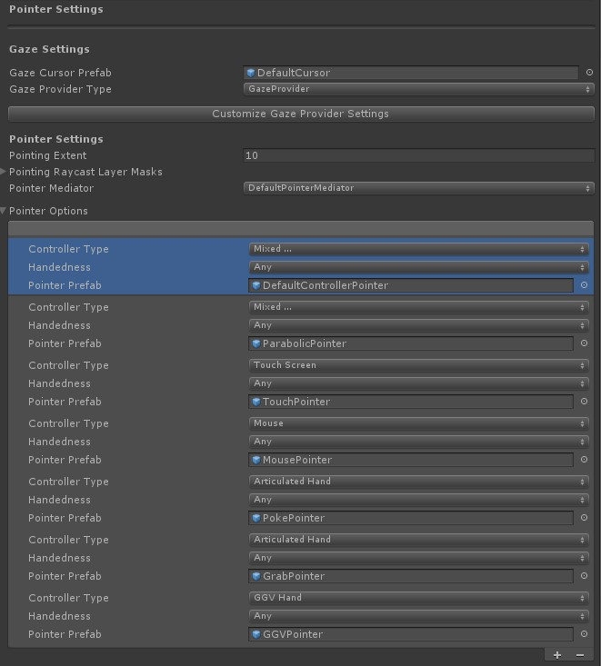

# Eyes + hand interaction

## How to support _look + hand motions_ (eye gaze & hand gestures)

This page explains how to use eye targeting as a primary pointer in combination with hand motions.
In our [MRTK eye tracking demos](EyeTracking_ExamplesOverview.md), we describe several examples for using eyes + hands, for example:

- [Selection](EyeTracking_TargetSelection.md): Looking at distant holographic button and simply performing a pinch gesture to quickly select it.
- [Positioning](EyeTracking_Positioning.md): Fluently move a hologram across your scene by simply looking at it, pinching your index finger and thumb together to grab it and then move it around using your hand.
- [Navigation](EyeTracking_Navigation.md): Simply look at a location you want to zoom in, pinch your index finger and thumb together and _pull_ your hand toward you to zoom in.

Please note that MRTK is currently designed in a way that at a distance hand rays act as the prioritized focus pointers.
This means that the head and eye gaze pointers will automatically be suppressed once a hand is detected and will become visible again after saying "Select".
However, this may not be the way you would like to interact at a distance and rather favor a simple _'gaze and commit'_ interaction independent of the presence of hands in your view.

### How to disable the hand ray

To disable the hand ray pointer, simply remove the _'DefaultControllerPointer'_ in your _Input -> Pointer_ MRTK configuration setting.
To use eyes and hands as described above in your app, please also make sure that you meet all of the [requirements for using eye tracking](EyeTracking_BasicSetup.md).



You can also check out, how the input profile _EyeTrackingDemoPointerProfile_ from the eye tracking sample package is set up as a reference.

### How to keep gaze pointer always on

To avoid having the head or eye gaze pointers automatically suppressed once a hand is detected, the gaze [`PointerBehavior`](xref:Microsoft.MixedReality.Toolkit.Input.PointerBehavior) can be specified to control whether it should be on or off.

```c#
// Turn on gaze pointer
PointerUtils.SetGazePointerBehavior(PointerBehavior.AlwaysOn);
```

See [`Controllers Pointers and Focus`](../Architecture/InputSystem/ControllersPointersAndFocus.md)

---
[Back to "Eye tracking in the MixedRealityToolkit"](EyeTracking_Main.md)
