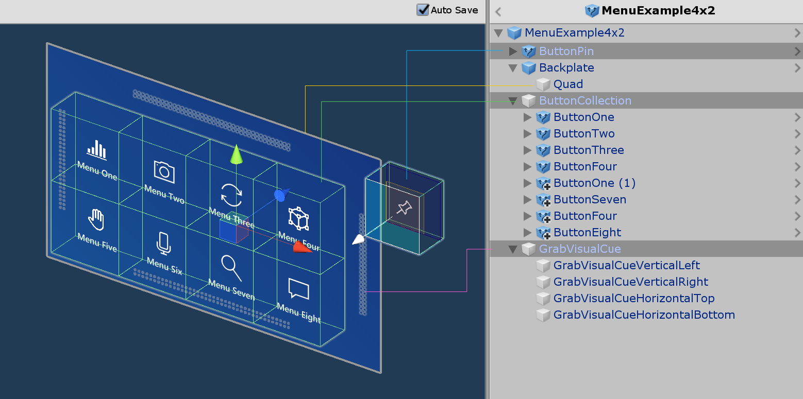

# Near menu

Near Menu is a UX control which provides a collection of buttons or other UI components. It is floating around the user's body and easily accessible anytime. Since it is loosely coupled with the user, it does not disturb the user's interaction with the target content. The user can use the 'Pin' button to world-lock/unlock the menu. The menu can be grabbed and placed at a specific position.

## Interaction behavior

- **Tag-along**: The menu follows you and stays within 30-60cm range from the user for the near interactions.
- **Pin**: Using the 'Pin' button, the menu can be world-locked and released.
- **Grab and move**: The menu is always grabbable and movable. Regardless of the previous state, the menu will be pinned(world-locked) when grabbed and released. There are visual cues for the grabbable area. They are revealed on hand proximity.

## Prefabs

Near Menu prefabs are designed to demonstrate how to use MRTK's various components to build menus for near interactions.

- **NearMenu2x4.prefab**
- **NearMenu3x1.prefab**
- **NearMenu3x2.prefab**
- **NearMenu3x3.prefab**
- **NearMenu4x1.prefab**
- **NearMenu4x2.prefab**

## Example scene

You can find examples of Near Menu prefabs in the `NearMenuExamples` scene.

## Structure

Near Menu prefabs are made with following MRTK components.

- [**PressableButtonHoloLens2**](README_Button.md) prefab
- [**Grid Object Collection**](README_ObjectCollection.md): Multiple button layout in grid
- [**Manipulation Handler**](README_ManipulationHandler.md): Grab and move the menu
- [**RadialView Solver**](README_Solver.md): Follow Me(tag-along) behavior

## How to customize

**1. Add/Remove Buttons**

Under `ButtonCollection` object, add or remove buttons.  

**2. Update the Grid Object Collection**

Click `Update Collection` button in the Inspector of the `ButtonCollection` object. It will update the grid layout.  

You can configure the number of rows using `Rows` property of the Grid Object Collection.  

**3. Adjust the backplate size**

Adjust the size of the `Quad` under `Backplate` object. The width and height of the backplate should be `0.032 * [Number of the buttons + 1]`. For example, if you have 3 x 2 buttons, the width of the backplate is `0.032 * 4` and the height is `0.032 * 3`. You can directly put this expression into the Unity's field.  

- Default size of the HoloLens 2 button is 3.2x3.2 cm (0.032m)

## See also

- [**Buttons**](README_Button.md)
- [**Bounds Control**](README_BoundsControl.md)
- [**Slider**](README_Sliders.md)
- [**Grid Object Collection**](README_ObjectCollection.md)
- [**Manipulation Handler**](README_ManipulationHandler.md)
- [**RadialView Solver**](README_Solver.md)
