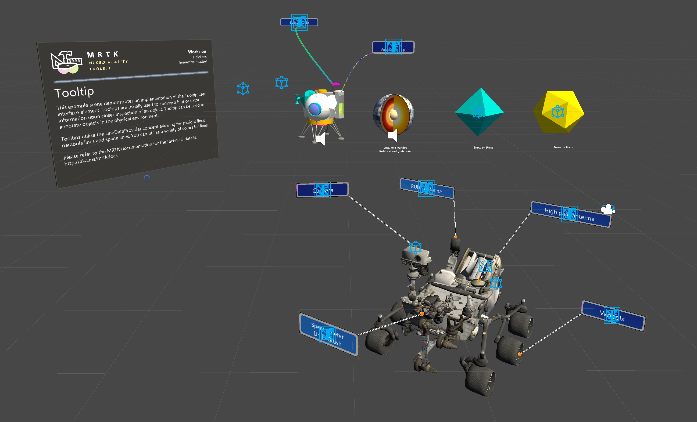

# Tooltip

Tooltips are usually used to convey a hint or extra information upon closer inspection of an object. Tooltips can be used to annotate objects in the physical environment.

## How to use a tooltip

A tooltip can be added directly to the hierarchy and targeted to an object.

To use this method simply add a game object and one of the tooltip prefabs (Assets/MRTK/SDK/Features/UX/Prefabs/Tooltips) to the scene hierarchy. In the prefab's inspector panel, expand the [`ToolTip`](xref:Microsoft.MixedReality.Toolkit.UI.ToolTip) script. Select a tip state and configure the tooltip.  Enter the respective text for the tool tip in the text field. Expand the [`ToolTipConnector`](xref:Microsoft.MixedReality.Toolkit.UI.ToolTipConnector) script and drag the object that is to have the tooltip from the hierarchy into the field labelled *Target*. This attaches the tooltip to the object.

This use assumes a tooltip that is always showing or that is shown / hidden via script by changing the tooltip state property of the tooltip component.

## Dynamically spawning tooltips

A tooltip can be dynamically added to an object at runtime as well as pre-set to show and hide on a tap or focus. Simply add the [`ToolTipSpawner`](xref:Microsoft.MixedReality.Toolkit.UI.ToolTipSpawner) script to any game object. Delays for appearing and disappearing can be set in the scripts inspector as well as a lifetime so that the tooltip will disappear after a set duration. Tooltips also feature style properties such as background visuals in the spawner script. By default the tooltip will be anchored to the object with the spawner script. This can be changed by assigning a GameObject to the anchor field.

## Example scene

In the example scenes (Assets/MRTK/Examples/Demos/UX/Tooltips/Scenes), you will be able to find various examples of tooltips.

